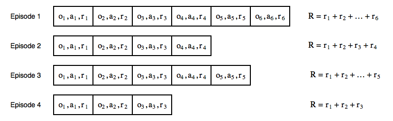

# Cross Entropy Method
The cross-entropy method falls into the model-free and policy-based category of methods.All the methods in RL can be classified into various aspects:
- Model-free or model-based
- Value-based or policy-based
- On-policy or off-policy

The term <b>model-free</b> means that the agent takes current observations and does some computations on them, and the result is the action that it should take.
In contrast, <b>model-based</b> methods try to predict what the next observation and/or
reward will be. Based on this prediction, the agent tries to choose the best possible
action to take, very often making such predictions multiple times to look more and
more steps into the future.

In <b>policy-based methods</b>, it directly approximate the
policy of the agent, that is, what actions the agent should carry out at every step. The
policy is usually represented by a probability distribution over the available actions. In contrast, the method could be <b>value-based</b>, instead of the probability
of actions, the agent calculates the value of every possible action and chooses the
action with the best value.

In <b>on-policy</b>, learns and updates the policy that is currently executing to make decisions, means it has single policy that is being updated based on the currrent data no historical data. <b>off-policy</b> has 2 policy one for exploring and collecting data and another is target policy that is being updated on the past data stored in <b>replay buffer</b> by first policy, the best example is <b>Q-Learning</b>.

So, our cross-entropy method is model-free, policy-based, and on-policy, which
means the following:
- It doesn't build any model of the environment; it just says to the agent what to do at every step
- It approximates the policy of the agent
- It requires fresh data obtained from the environment

## The cross-entropy method in practice
It needs to pass an observation
from the environment to the NN, get a probability distribution over actions, and
perform random sampling using the probability distribution to get an action to
carry out. This random sampling adds randomness to our agent, After the agent gets an action to issue, it fires the action to
the environment and obtains the next observation and reward for the last action.
Then the loop continues.

During the agent's lifetime, its experience is presented as episodes. Every episode is
a sequence of observations that the agent has got from the environment, actions it
has issued, and rewards for these actions.


Every cell represents the agent's step in the episode. Due to randomness in the
environment and the way that the agent selects actions to take, some episodes
will be better than others. The core of the cross-entropy method is to throw away
bad episodes and train on better ones. So, the steps of the method are as follows:

1. Play N number of episodes using our current model and environment.
2. Calculate the total reward for every episode and decide on a reward boundary. Usually, we use some percentile of all rewards, such as 50th or 70th.
3. Throw away all episodes with a reward below the boundary.
4. Train on the remaining "elite" episodes using observations as the input and issued actions as the desired output.
5. Repeat from step 1 until we become satisfied with the result.

With the preceding procedure,
our NN learns how to repeat actions, which leads to a larger reward, constantly
moving the boundary higher and higher. Despite the simplicity of this method,
it works well in basic environments, it's easy to implement, and it's quite robust
to hyperparameters changing.

## The cross-entropy method on CartPole
Model's core is a one-hidden-layer
NN, with rectified linear unit (ReLU) and 128 hidden neurons (which is absolutely
arbitrary). The count of episodes we play on every iteration (16), and the
percentile of episodes' total rewards that we use for "elite" episode filtering. We will
take the 70th percentile, which means that we will leave the top 30% of episodes
sorted by reward.
```python
HIDDEN_SIZE = 128
BATCH_SIZE = 16
PERCENTILE = 70
```
Here we will define two helper classes
- <b>EpisodeStep:</b> This will be used to represent one single step that our agent
made in the episode, and it stores the observation from the environment
and what action the agent completed. We will use episode steps from "elite"
episodes as training data.
- <b>Episode:</b> This is a single episode stored as total undiscounted reward and a collection of EpisodeStep.